# 使用ggplot2画图

## Why use ggplot2
ggplot2是我见过最human friendly的画图软件，这得益于Leland Wilkinson在他的著作[《The Grammar of Graphics》](http://book.douban.com/subject/10123863/)中提出了一套图形语法，把图形元素抽象成可以自由组合的成分，Hadley Wickham把这套想法在R中实现。

为什么要学习ggplot2，可以参考[ggplot2: 数据分析与图形艺术](http://book.douban.com/subject/24527091/)的[序言](https://github.com/cosname/ggplot2-translation/blob/master/preface.md)（btw: 在序言的最后，我被致谢了）。

Hadley Wickham也给出一堆[理由](https://github.com/hadley/ggplot2/wiki/Why-use-ggplot2)让我们说服自己，我想再补充一点，Hadley Wickham是[学医出身](http://www.analyticstory.com/hadley-wickham/)的，做为学生物出身的人有什么理由不支持呢:)


## ggplot2基本要素
+ 数据（Data）和映射（Mapping）
+ 几何对象（Geometric）
+ 标尺（Scale）
+ 统计变换（Statistics）
+ 坐标系统（Coordinante）
+ 图层（Layer）
+ 分面（Facet）
+ 主题（Theme）

这里将从这些基本要素对ggplot2进行介绍。

## 数据（Data）和映射（Mapping)
下面以一份钻石的数据为例，这份数据非常大，随机取一个子集来画图。

```r
require(ggplot2)
data(diamonds)
set.seed(42)
small<-diamonds[sample(nrow(diamonds),1000),] 
head(small)
```

```
##       carat       cut color clarity depth table price    x    y    z
## 49345  0.71 Very Good     H     SI1  62.5    60  2096 5.68 5.75 3.57
## 50545  0.79   Premium     H     SI1  61.8    59  2275 5.97 5.91 3.67
## 15434  1.03     Ideal     F     SI1  62.4    57  6178 6.48 6.44 4.03
## 44792  0.50     Ideal     E     VS2  62.2    54  1624 5.08 5.11 3.17
## 34614  0.27     Ideal     E     VS1  61.6    56   470 4.14 4.17 2.56
## 27998  0.30   Premium     E     VS2  61.7    58   658 4.32 4.34 2.67
```

```r
summary(small)
```

```
##      carat              cut      color      clarity        depth     
##  Min.   :0.220   Fair     : 28   D:121   SI1    :258   Min.   :55.2  
##  1st Qu.:0.400   Good     : 88   E:186   VS2    :231   1st Qu.:61.0  
##  Median :0.710   Very Good:227   F:164   SI2    :175   Median :61.8  
##  Mean   :0.819   Premium  :257   G:216   VS1    :141   Mean   :61.7  
##  3rd Qu.:1.070   Ideal    :400   H:154   VVS2   : 91   3rd Qu.:62.5  
##  Max.   :2.660                   I:106   VVS1   : 67   Max.   :72.2  
##                                  J: 53   (Other): 37                 
##      table          price             x              y       
##  Min.   :50.1   Min.   :  342   Min.   :3.85   Min.   :3.84  
##  1st Qu.:56.0   1st Qu.:  990   1st Qu.:4.74   1st Qu.:4.76  
##  Median :57.0   Median : 2595   Median :5.75   Median :5.78  
##  Mean   :57.4   Mean   : 4111   Mean   :5.79   Mean   :5.79  
##  3rd Qu.:59.0   3rd Qu.: 5495   3rd Qu.:6.60   3rd Qu.:6.61  
##  Max.   :65.0   Max.   :18795   Max.   :8.83   Max.   :8.87  
##                                                              
##        z       
##  Min.   :2.33  
##  1st Qu.:2.92  
##  Median :3.55  
##  Mean   :3.57  
##  3rd Qu.:4.07  
##  Max.   :5.58  
## 
```
画图实际上是把数据中的变量映射到图形属性上。以克拉(carat)数为X轴变量，价格(price)为Y轴变量。

```r
p <- ggplot(data=small, mapping=aes(x=carat, y=price))
```
上面这行代码把数据映射XY坐标轴上，需要告诉ggplot2，这些数据要映射成什么样的几何对象，下面以散点为例：

```r
p+geom_point()
```

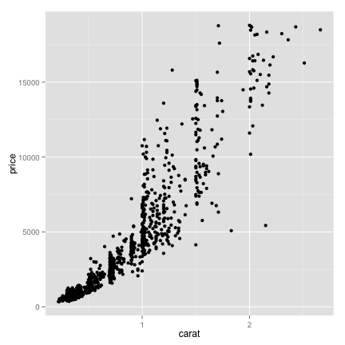 
几何对象将在下面的小节介绍，这一节，关注的是数据和图形属性之间的映射。

如果想将切工（cut）映射到形状属性。只需要：

```r
p <- ggplot(data=small, mapping=aes(x=carat, y=price, shape=cut))
p+geom_point()
```

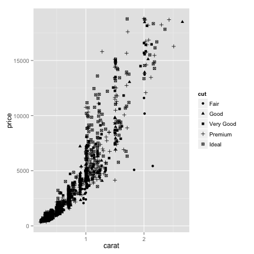 

再比如我想将钻石的颜色（color）映射颜色属性：

```r
p <- ggplot(data=small, mapping=aes(x=carat, y=price, shape=cut, colour=color))
p+geom_point()
```

 

## 几何对象（Geometric）
在上面的例子中，各种属性映射由ggplot函数执行，只需要加一个图层，使用geom_point()告诉ggplot要画散点，于是所有的属性都映射到散点上。

geom_point()完成的就是几何对象的映射，ggplot2提供了各种几何对象映射，如geom_histogram用于直方图，geom_bar用于画柱状图，geom_boxplot用于画箱式图等等。

不同的几何对象，要求的属性会有些不同，这些属性也可以在几何对象映射时提供，比如上一图，也可以用以下语法来画：
```
p <- ggplot(small)
p+geom_point(aes(x=carat, y=price, shape=cut, colour=color))
```

ggplot2支持图层，我通常把不同的图层中共用的映射提供给ggplot函数，而某一几何对象才需要的映射参数提供给geom_xxx函数。

这一小节我们来看一下各种常用的几何对象。

### 直方图
直方图最容易，提供一个x变量，画出数据的分布。

```r
ggplot(small)+geom_histogram(aes(x=price))
```

```
## stat_bin: binwidth defaulted to range/30. Use 'binwidth = x' to adjust this.
```

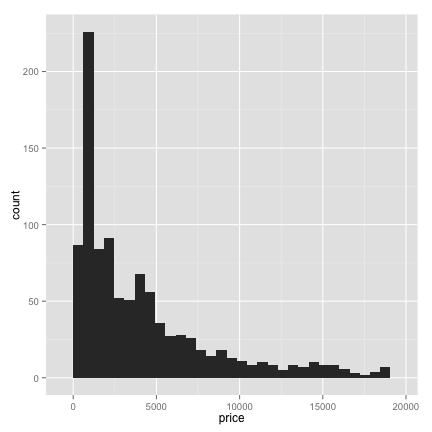 
同样可以根据另外的变量给它填充颜色，比如按不同的切工：

```r
ggplot(small)+geom_histogram(aes(x=price, fill=cut))
```

```
## stat_bin: binwidth defaulted to range/30. Use 'binwidth = x' to adjust this.
```

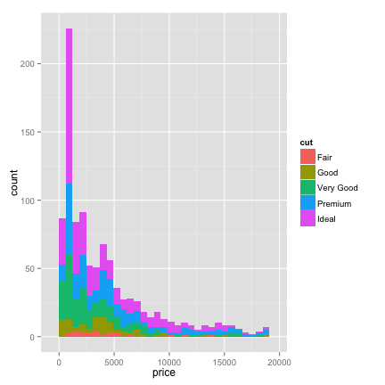 
也可以将其分开，side-by-side地画直方图。

```r
ggplot(small)+geom_histogram(aes(x=price, fill=cut), position="dodge")
```

```
## stat_bin: binwidth defaulted to range/30. Use 'binwidth = x' to adjust this.
```

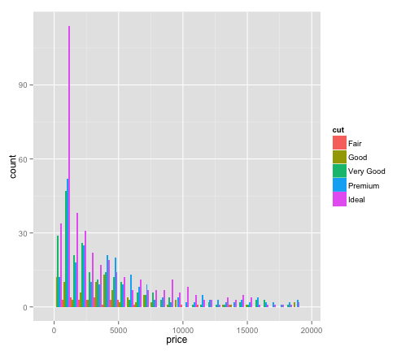 

还可以使用position="fill"，按照相对比例来画。

```r
ggplot(small)+geom_histogram(aes(x=price, fill=cut), position="fill")
```

```
## stat_bin: binwidth defaulted to range/30. Use 'binwidth = x' to adjust this.
```

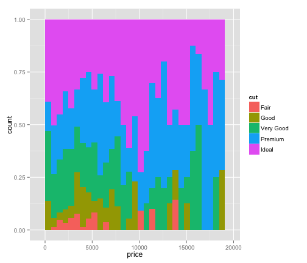 
### 柱状图
柱状图非常适合于画分类变量。在这里以透明度（clarity）变量为例。按照不同透明度的钻石的数目画柱状图。

```r
ggplot(small)+geom_bar(aes(x=clarity))
```

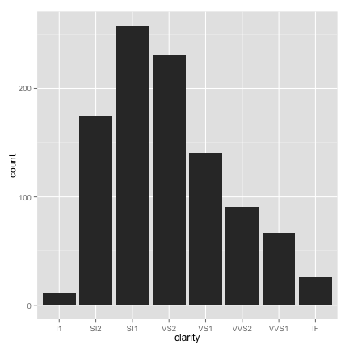 
柱状图两个要素，一个是分类变量，一个是数目，也就是柱子的高度。数目在这里不用提供，因为ggplot2会通过x变量计算各个分类的数目。

当然你想提供也是可以的，通过stat参数，可以让geom_bar按指定高度画图，比如以下代码：

```r
ggplot()+geom_bar(aes(x=c(LETTERS[1:3]),y=1:3), stat="identity")
```

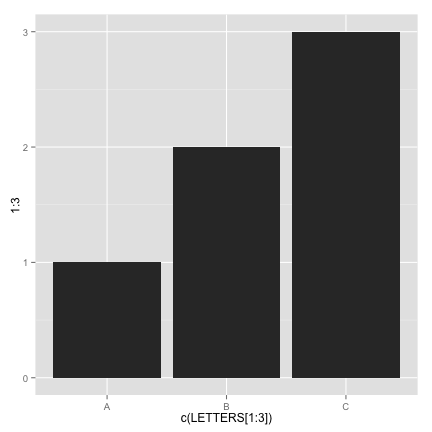 

柱状图和直方图是很像的，直方图把连续型的数据按照一个个等长的分区（bin）来切分，然后计数，画柱状图。而柱状图是分类数据，按类别计数。我们可以用前面直方图的参数来画side-by-side的柱状图，填充颜色或者按比例画图，它们是高度一致的。

柱状图是用来表示计数数据的，但在生物界却被经常拿来表示均值，加上误差来表示数据分布，这可以通常图层来实现，我将在图层一节中给出实例。

### 密度函数图
说到直方图，就不得不说密度函数图，数据和映射和直方图是一样的，唯一不同的是几何对象，geom_histogram告诉ggplot要画直方图，而geom_density则说我们要画密度函数图，在我们熟悉前面语法的情况下，很容易画出：

```r
ggplot(small)+geom_density(aes(x=price, colour=cut))
```

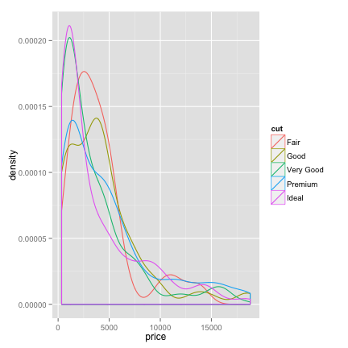 


```r
ggplot(small)+geom_density(aes(x=price,fill=clarity))
```

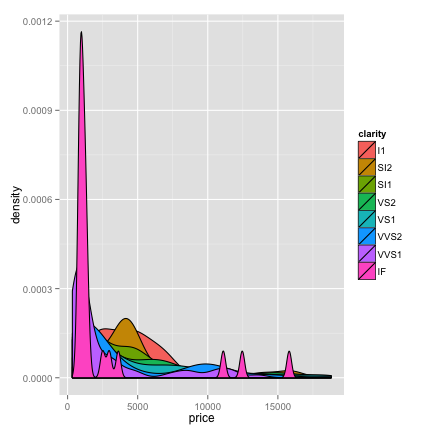 

colour参数指定的是曲线的颜色，而fill是往曲线下面填充颜色。

### 箱式图
数据量比较大的时候，用直方图和密度函数图是表示数据分布的好方法，而在数据量较少的时候，比如很多的生物实验，很多时候大家都是使用柱状图+errorbar的形式来表示，不过这种方法的信息量非常低，被[Nature Methods吐槽](http://ygc.name/2014/03/04/boxplot/)，这种情况推荐使用boxplot。

```r
ggplot(small)+geom_boxplot(aes(x=cut, y=price,fill=color))
```

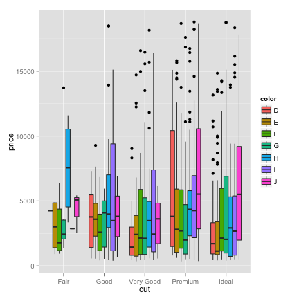 
geom_boxplot将数据映射到箱式图上，上面的代码，我们应该很熟悉了，按切工(cut)分类，对价格(price)变量画箱式图，再分开按照color变量填充颜色。

ggplot2提供了很多的geom_xxx函数，可以满足我们对各种图形绘制的需求。
```
geom_abline 	geom_area 	
geom_bar 		geom_bin2d
geom_blank 		geom_boxplot 	
geom_contour 	geom_crossbar
geom_density 	geom_density2d 	
geom_dotplot 	geom_errorbar
geom_errorbarh 	geom_freqpoly 	
geom_hex 		geom_histogram
geom_hline 		geom_jitter 	
geom_line 		geom_linerange
geom_map 		geom_path 	
geom_point 		geom_pointrange
geom_polygon 	geom_quantile 	
geom_raster 	geom_rect
geom_ribbon 	geom_rug 	
geom_segment 	geom_smooth
geom_step 		geom_text 	
geom_tile 		geom_violin
geom_vline
```

## 标尺（Scale）
前面我们已经看到了，画图就是在做映射，不管是映射到不同的几何对象上，还是映射各种图形属性。这一小节介绍标尺，在对图形属性进行映射之后，使用标尺可以控制这些属性的显示方式，比如坐标刻度，可能通过标尺，将坐标进行对数变换；比如颜色属性，也可以通过标尺，进行改变。


```r
ggplot(small)+geom_point(aes(x=carat, y=price, shape=cut, colour=color))+scale_y_log10()+scale_colour_manual(values=rainbow(7))
```

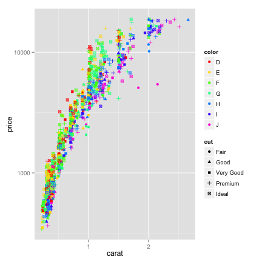 
以数据（Data）和映射（Mapping)一节中所画散点图为例，将Y轴坐标进行log10变换，再自己定义颜色为彩虹色。

## 统计变换（Statistics）
统计变换对原始数据进行某种计算，然后在图上表示出来，例如对散点图上加一条回归线。


```r
ggplot(small, aes(x=carat, y=price))+geom_point()+scale_y_log10()+stat_smooth()
```

```
## geom_smooth: method="auto" and size of largest group is >=1000, so using gam with formula: y ~ s(x, bs = "cs"). Use 'method = x' to change the smoothing method.
```

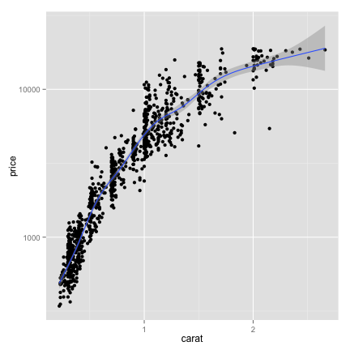 
这里就不按颜色、切工来分了，不然ggplot会按不同的分类变量分别做回归，图就很乱，如果我们需要这样做，我们可以使用分面，这个将在后面介绍。

这里，aes所提供的参数，就通过ggplot提供，而不是提供给geom_point，因为ggplot里的参数，相当于全局变量，geom_point()和stat_smooth()都知道x,y的映射，如果只提供给geom_point()，则相当于是局部变量，geom_point知道这种映射，而stat_smooth不知道，当然你再给stat_smooth也提供x,y的映射，不过共用的映射，还是提供给ggplot好。

ggplot2提供了多种统计变换方式：
```
stat_abline       stat_contour      stat_identity     stat_summary
stat_bin          stat_density      stat_qq           stat_summary2d
stat_bin2d        stat_density2d    stat_quantile     stat_summary_hex
stat_bindot       stat_ecdf         stat_smooth       stat_unique
stat_binhex       stat_function     stat_spoke        stat_vline
stat_boxplot      stat_hline        stat_sum          stat_ydensity
```

统计变换是非常重要的功能，我们可以自己写函数，基于原始数据做某种计算，并在图上表现出来，也可以通过它改变geom_xxx函数画图的默认统计参数。
比如我在[Proteomic investigation of the interactome of FMNL1 in hematopoietic cells unveils a role in calcium-dependent membrane plasticity](http://www.sciencedirect.com/science/article/pii/S1874391912007567)的图一中，就把boxplot的中位线替换成了平均值来作图。


## 坐标系统（Coordinante）
坐标系统控制坐标轴，可以进行变换，例如XY轴翻转，笛卡尔坐标和极坐标转换，以满足我们的各种需求。

坐标轴翻转由coord_flip()实现

```r
ggplot(small)+geom_bar(aes(x=cut, fill=cut))+coord_flip()
```

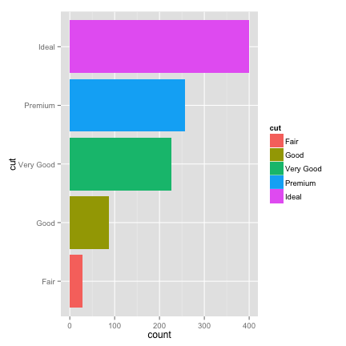 

而转换成极坐标可以由coord_polar()实现：

```r
ggplot(small)+geom_bar(aes(x=factor(1), fill=cut))+coord_polar(theta="y")
```

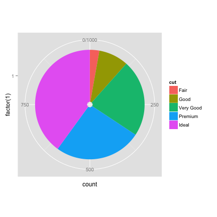 
这也是为什么之前介绍常用图形画法时没有提及饼图的原因，饼图实际上就是柱状图，只不过是使用极坐标而已，柱状图的高度，对应于饼图的弧度，饼图并不推荐，因为人类的眼睛比较弧度的能力比不上比较高度（柱状图）。

还可以画靶心图：

```r
ggplot(small)+geom_bar(aes(x=factor(1), fill=cut))+coord_polar()
```

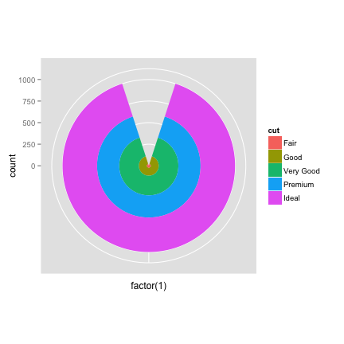 
以及风玫瑰图(windrose)

```r
ggplot(small)+geom_bar(aes(x=clarity, fill=cut))+coord_polar()
```

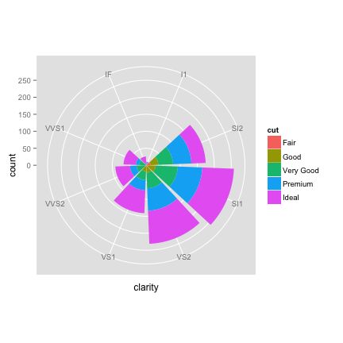 
 
## 图层（Layer）
photoshop流行的原因在于PS 3.0时引入图层的概念，ggplot的牛B之处在于使用+号来叠加图层，这堪称是泛型编程的典范。
在前面散点图上，我们已经见识过，加上了一个回归线拟合的图层。 

在[RT-PCR统计分析](http://www.ygc.name/stats/RT_PCR.html)中，我使用geom_bar()画了一个柱状图，再使用geom_errorbar()画了标准误，两个图层一叠加，就成了我们常画的加了errorbar的柱状图。

有了图层的概念，使用ggplot画起图来，就更加得心应手。

做为图层的一个很好的例子是[蝙蝠侠logo](http://ygc.name/2011/08/14/bat-man/)，batman logo由6个函数组成，在下面的例子中，我先画第一个函数，之后再加一个图层画第二个函数，不断重复这一过程，直到六个函数全部画好。


```r
require(grid)
require(ggplot2)
 
f1 <- function(x) {
    y1 <- 3*sqrt(1-(x/7)^2)
    y2 <- -3*sqrt(1-(x/7)^2)
    y <- c(y1,y2)
    d <- data.frame(x=x,y=y)
    d <- d[d$y > -3*sqrt(33)/7,]
    return(d)
}
 
x1 <- c(seq(3, 7, 0.001), seq(-7, -3, 0.001))
d1 <- f1(x1)
p1 <- ggplot(d1,aes(x,y)) + geom_point(color="red") +xlab("") + ylab("") + theme_bw()
 
x2 <- seq(-4,4, 0.001)
y2 <- abs(x2/2)-(3*sqrt(33)-7)*x2^2/112-3 + sqrt(1-(abs(abs(x2)-2)-1)^2)
d2 <- data.frame(x2=x2, y2=y2)
p2 <- p1 + geom_point(data=d2, aes(x=x2,y=y2), color="yellow")
 
x3 <- c(seq(0.75,1,0.001), seq(-1,-0.75,0.001))
y3 <- 9-8*abs(x3)
d3 <- data.frame(x3=x3, y3=y3)
p3 <- p2+geom_point(data=d3, aes(x=x3,y=y3), color="green")
 
x4 <- c(seq(0.5,0.75,0.001), seq(-0.75,-0.5,0.001))
y4 <- 3*abs(x4)+0.75
d4 <- data.frame(x4=x4,y4=y4)
p4 <- p3+geom_point(data=d4, aes(x=x4,y=y4), color="steelblue")
  
x5 <- seq(-0.5,0.5,0.001)
y5 <- rep(2.25,length(x5))
d5 <- data.frame(x5=x5,y5=y5)
p5 <- p4+geom_point(data=d5, aes(x=x5,y=y5))
 
x6 <- c(seq(-3,-1,0.001), seq(1,3,0.001))
y6 <- 6 * sqrt(10)/7 +
    (1.5 - 0.5 * abs(x6)) * sqrt(abs(abs(x6)-1)/(abs(x6)-1)) -
    6 * sqrt(10) * sqrt(4-(abs(x6)-1)^2)/14
d6 <- data.frame(x6=x6,y6=y6)
p6 <- p5+geom_point(data=d6,aes(x=x6,y=y6), colour="blue")

multiplot <- function (..., plotlist = NULL, cols = 1, layout = NULL) {
    plots <- c(list(...), plotlist)
    numPlots = length(plots)
    if (is.null(layout)) {
        layout <- matrix(seq(1, cols * ceiling(numPlots/cols)),
            ncol = cols, nrow = ceiling(numPlots/cols))
    }
    if (numPlots == 1) {
        print(plots[[1]])
    }
    else {
        grid.newpage()
        pushViewport(viewport(layout = grid.layout(nrow(layout),
            ncol(layout))))
        for (i in 1:numPlots) {
            matchidx <- as.data.frame(which(layout == i, arr.ind = TRUE))
            print(plots[[i]], vp = viewport(layout.pos.row = matchidx$row,
                layout.pos.col = matchidx$col))
        }
    }
}

multiplot(p1,p2,p3,p4,p5,p6, cols=2)
```

```
## Warning: Removed 2 rows containing missing values (geom_point).
```

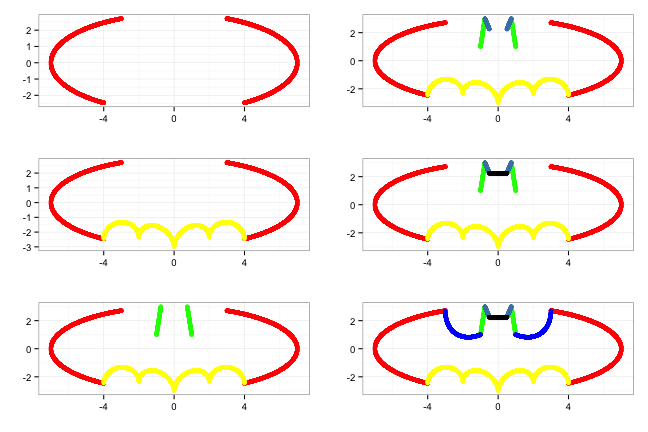 


## 分面（Facet）
在《[ggplot2: 数据分析与图形艺术](http://book.douban.com/subject/24527091/)》一书的翻译中，一开始译者把facet翻译成切片，我在校稿的时候发现了，给他们写信，推荐翻译成分面，如果是slice这个词，翻译成切片倒是很精准，BSD的硬盘分区就叫slice，但facet从词源上看就是小脸的意思，翻译成分面才到位。给他们写信的时候，我还专门查了[CNKI翻译助手](http://dict.cnki.net/)，发现这词在信息学中，翻成分面早已是固定的。我感觉这是我对这本书翻译的最大贡献，校稿过程中发现的少量小问题远比不上这个关键词意思的把握上。

分面可以让我们按照某种给定的条件，对数据进行分组，然后分别画图。
在统计变换一节中，提到如果按切工分组作回归线，显然图会很乱，有了分面功能，我们可以分别作图。

```r
ggplot(small, aes(x=carat, y=price))+geom_point(aes(colour=cut))+scale_y_log10() +facet_wrap(~cut)+stat_smooth()
```

```
## geom_smooth: method="auto" and size of largest group is <1000, so using loess. Use 'method = x' to change the smoothing method.
## geom_smooth: method="auto" and size of largest group is <1000, so using loess. Use 'method = x' to change the smoothing method.
## geom_smooth: method="auto" and size of largest group is <1000, so using loess. Use 'method = x' to change the smoothing method.
## geom_smooth: method="auto" and size of largest group is <1000, so using loess. Use 'method = x' to change the smoothing method.
## geom_smooth: method="auto" and size of largest group is <1000, so using loess. Use 'method = x' to change the smoothing method.
```

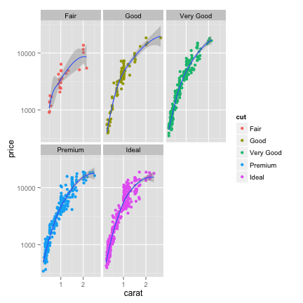 

## 主题（Theme）
通过ggplot画图之后，我们可能还需要对图进行定制，像title, xlab, ylab这些高频需要用到的，自不用说，ggplot2提供了ggtitle(), xlab()和ylab()来实现。
比如：

```r
p <- ggplot(small)+geom_boxplot(aes(x=cut, y=price,fill=color))
p + ggtitle("Price vs Cut")+xlab("Cut")+ylab("Price")
```

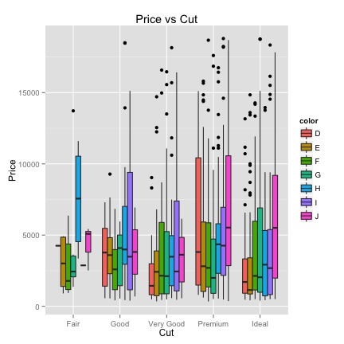 

但是这个远远满足不了需求，我们需要改变字体，字体大小，坐标轴，背景等各种元素，这需要通过theme()函数来完成。

ggplot2提供一些已经写好的主题，比如theme_grey()为默认主题，我经常用的theme_bw()为白色背景的主题，还有theme_classic()主题，和R的基础画图函数较像。

别外ggthemes包提供了一些主题可供使用，包括：

```
theme_economist theme_economist_white
theme_wsj 	 	theme_excel
theme_few 	 	theme_foundation
theme_igray 	theme_solarized
theme_stata 	theme_tufte
```

```r
require(ggthemes)
p + theme_wsj()
```

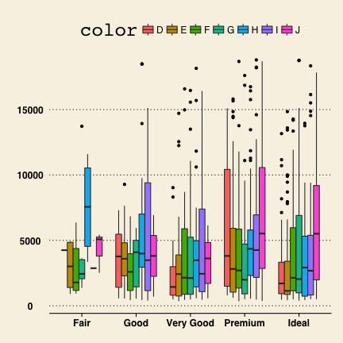 

在2013年发表的文章[Putative cobalt- and nickel-binding proteins and motifs in Streptococcus pneumoniae](http://pubs.rsc.org/en/content/articlelanding/2013/mt/c3mt00126a#!divAbstract)中的图3就是使用theme_stata来画的。

至于如何改变这些元素，我觉得我之前[画囧字的博文](http://ygc.name/2012/02/17/draw-chinese-character-jiong-ggplot2/)可以做为例子：


```r
f <- function(x) 1/(x^2-1)
x <- seq(-3,3, by=0.001)
y <- f(x)
d <- data.frame(x=x,y=y)
 
p <- ggplot()
p <- p+geom_rect(fill = "white",color="black",size=3,
aes(NULL, NULL,xmin=-3, xmax=3,
ymin=-3,ymax=3, alpha=0.1))
 
p <- p + geom_line(data=d, aes(x,y), size=3)+ylim(-3,3)

theme_null <- function() {
    theme_bw() %+replace%
	theme(axis.text.x=element_blank(),
	axis.text.y=element_blank(),
	legend.position="none",
	panel.grid.minor=element_blank(),
	panel.grid.major=element_blank(),
	panel.background=element_blank(),
	axis.ticks=element_blank(),
	panel.border=element_blank())
}
 
p+theme_null()+xlab("")+ylab("")
```

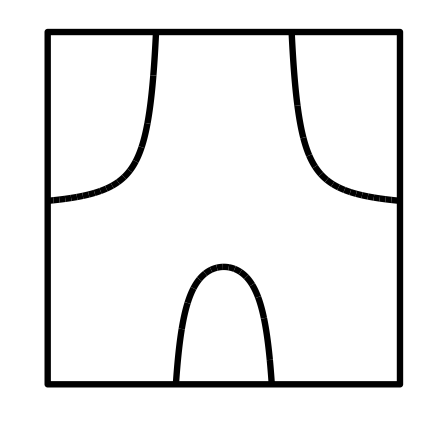 

详细的说明，可以参考?theme的帮助文档。

## 二维密度图
在这个文档里，为了作图方便，我们使用diamonds数据集的一个子集，如果使用全集，数据量太大，画出来散点就糊了，这种情况可以使用二维密度力来呈现。

```r
ggplot(diamonds, aes(carat, price))+ stat_density2d(aes(fill = ..level..), geom="polygon")+ scale_fill_continuous(high='darkred',low='darkgreen')
```

 

## ggplot2实战

果壳知性里有帖子介绍了个[猥琐邪恶的曲线图](http://sex.guokr.com/post/852889/)，引来无数宅男用各种工具来画图，甚至于3D动态图都出来了。这里用ggplot2来画。

```r
f <- function(a, b, y)	a * y * log(y) - 1/b * exp(-(b*y - b/exp(1))^4)

y <- seq(0.001, 1, 0.01)
x1 <- f(3, 30, y)
x2 <- f(2.5, 36, y)
x3 <- f(2, 50, y)

d <- data.frame(x=c(x1,x2,x3), y=rep(y,3), type=rep(LETTERS[1:3], each=length(y)))
p <- ggplot(d, aes(x,y, color=type)) + geom_path()
p <- p+scale_color_discrete(labels=list(expression(paste(alpha==3, ',', beta==30)), expression(paste(alpha==2.5, ',', beta==36)), expression(paste(alpha==2, ',', beta==50)) ))
p <- p+geom_text(x=-0.75, y=.9, label="alpha %.% y %.% log(y) - frac(1, beta) %.% e^-(beta %.% y - frac(beta, e))^4", parse=T, color="black", size=8, family="Helvetica", face="plain")
p+theme_bw() + xlab("")+ylab("") + theme(legend.position=c(.25,.75), legend.title=element_blank())
```

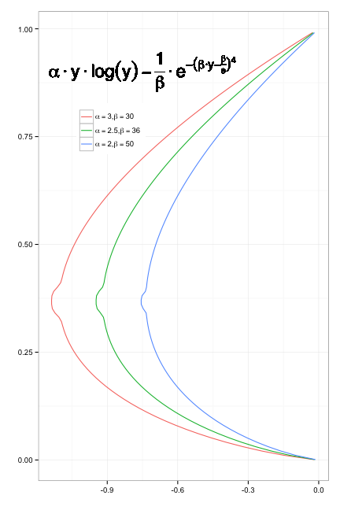 
其实在这里，我想展示的是对数学符号和公式的处理，另外一个例子是我以前画的[根号2](http://ygc.name/2011/08/12/sqrt_2/) 。

再来一个蝴蝶图，详见《Modern Applied Statistics with S-PLUS》第一章。

```r
theta <- seq(0,24*pi, len=2000)
radius <- exp(cos(theta)) - 2*cos(4*theta) + sin(theta/12)^5
dd <- data.frame(x=radius*sin(theta), y=radius*cos(theta))
ggplot(dd, aes(x, y))+geom_path()+theme_null()+xlab("")+ylab("")
```

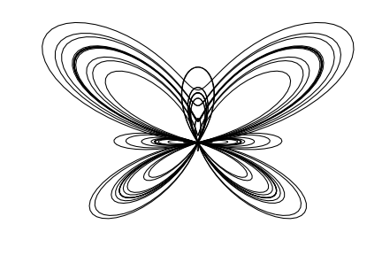 
这个图，我想展示的是对细节的修改上，在画囧字的时候，把画布上的元素都给清楚了，我把它定义为theme_null主题，在这里，直接应用，我们可以形成自己的画图风格，并写出自己的主题函数固定下来。    


最后以生物界中常用的柱状图+误差图为实例，展示ggplot2非常灵活的图层。以我2011年发表的文章[Phosphoproteome profile of human lung cancer cell line A549](http://ygc.name/2010/11/23/phosphoproteome-profile-of-human-lung-cancer-cell-line-a549/)中的westernblot数据为例。这个实例展示了图层，标尺，主题，注释和各种细节微调多种元素。

```r
Normal <- c(0.83, 0.79, 0.99, 0.69)
Cancer <- c(0.56, 0.56, 0.64, 0.52)
m <- c(mean(Normal), mean(Cancer))
s <- c(sd(Normal), sd(Cancer))
d <- data.frame(V=c("Normal", "Cancer"), mean=m, sd=s)
d$V <- factor(d$V, levels=c("Normal", "Cancer"))

p <- ggplot(d, aes(V, mean, fill=V, width=.5))
p <- p+geom_errorbar(aes(ymin=mean, ymax=mean+sd, width=.2), 
                     position=position_dodge(width=.8))
p <- p + geom_bar(stat="identity", position=position_dodge(width=.8), colour="black")
p <- p + scale_fill_manual(values=c("grey80", "white"))
p <- p + theme_bw() +theme(legend.position="none") + xlab("") + ylab("")
p <- p + theme(axis.text.x = element_text(face="bold", size=12), 
               axis.text.y = element_text(face="bold", size=12))
p <- p+scale_y_continuous(expand=c(0,0), limits=c(0, 1.2), breaks=seq(0, 1.2, by=.2))
p <- p+geom_segment(aes(x=1, y=.98, xend=1, yend=1.1))
p <- p+geom_segment(aes(x=2, y=.65, xend=2, yend=1.1))
p <- p+geom_segment(aes(x=1, y=1.1, xend=2, yend=1.1))
p <- p + annotate("text", x=1.5, y=1.08, label="*")
print(p)
```

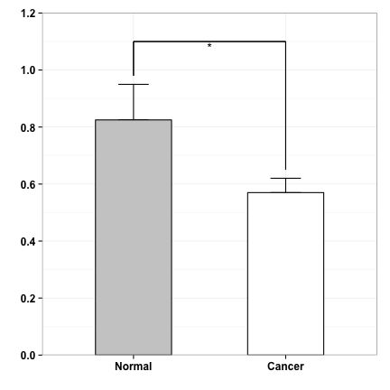 

更多实例，可以参考我使用[ggplot2实现<25 Recipes for Getting Started with R>一书中的所有图片](http://ygc.name/2011/08/17/ggplot2-version-figures-25-recipes-started-r/).

```
2013-05-18
```
