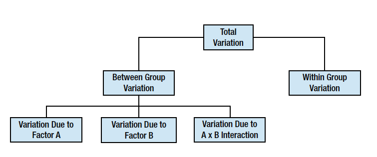

# Two-Way ANOVA
ANOVA可以分析两个或多个因子的复合效应，ANOVA的设计越复杂，对结果的解析同样会变得很复杂。




双向ANOVA分析是单向ANOVA的扩展，分析两个因素，我们称之为A和B，假如A有r个水平，B有c个水平，则总共有rxc个分组，每个分组的数据数目要一致。

## 前提条件
使用Two-Way ANOVA，需要满足以下假设：
+ 总体须是正态分布或接近于正态分布
+ 样本必须是独立样本
+ 方差齐性
+ 分组样本量一样

## 零假设
双向ANOVA能够同时检验3个零假设：
+ 单独考虑A因素，总体均值间没有差别。这相当于对A因子进行单向ANOVA
+ 单独考虑B因素，总体均值间没有差别。这相当于对B因子进行单向ANOVA
+ A和B两个因素，没有相互作用。这相当于使用二联表进行独立性分析


## 方差计算
```{r}
data <- read.table("data/gender_dose.tsv", header=TRUE)
data
```
我们来分析上面这份数据，看Gender和Dosage两个因素对Alerness水平的影响。Gender和Dosage都是2个水平，这是最简单的2x2设计。
进行双向方差分析，需要计算6个方差。

### 总方差
不对数据进行分组，计算出来的方差，为总方差，自由度为样本量减1.
```{r}
grand.mean <- with(data, mean(Alertness))
N <- with(data, length(Alertness))
N
SS.tot <- with(data, sum((Alertness-grand.mean)^2))
SS.tot
```

### 单元格方差
两个因素A和B，分别有r和c个水平，则组成rxc的二联表，把数据分成rxc个组，和单向ANOVA分析一样，计算组间方差：
$$ SS_{tot} = \sum(x-\bar{\bar{x}})^2$$
```{r}
require(plyr)
grp <- ddply(data, .(Gender, Dosage), function(x) data.frame(n=length(x$Alertness), m=mean(x$Alertness)))
grp
SS.cells <- with(grp, sum(n*(m-grand.mean)^2))
SS.cells
```

### 因素A的方差
只考虑因素A，对于这个数据来说，是性别因素，只使用性别因素对数据进行分组，按单向ANOVA分析一样，计算组间方差：
```{r}
Am <- with(data, tapply(Alertness, Gender, mean))
An <- with(data, tapply(Alertness, Gender, length))
SS.gender <- sum(An * (Am - grand.mean)^2)
SS.gender
```
自由度是因素A的水平减1，既r-1，这里r=2，所以df=1。

### 因素B的方差
只考虑因素B，对于这个数据来说，是药剂用量因素，只使用dosage因素对数据进行分组，按单向ANOVA分析一样，计算组间方差：
```{r}
Bm <- with(data, tapply(Alertness, Dosage, mean))
Bn <- with(data, tapply(Alertness, Dosage, length))
SS.dosage <- sum(Bn * (Bm - grand.mean)^2)
SS.dosage
```
自由度是因素B的水平减1，既c-1，这里c=2，所以df=1。

### 因素A和B相互作用的方差
单元格方差由A因素和B因素组成，可以拆分为因素A的方差、因素B的方差和AB互作的方差，即：
$$ SS_{cells} = SS_A + SS_B + SS_{AB}$$
所以A和B互作的方差：
$$ SS_{AB} = SS_{cells} - SS_A - SS_B$$
```{r}
SS.gender.dosage <- SS.cells - SS.gender - SS.dosage
SS.gender.dosage
```
自由度是A的自由度乘以B的自由度，即：(r-1)(c-1)。

### 误差方差
最后是组内方差，它度量误差，方差分析和线性回归是高度一致的，在R的aov函数里，会把误差方差写成残差方差，这其实来自于线性回归。
```{r}
dw <- ddply(data, .(Gender, Dosage), function(x) x$Alertness - mean(x$Alertness))
dw
sum(dw[,-c(1,2)]^2)
```
上面按照A和B两个因素，分成rxc组，按单向ANOVA分析方法，计算组内方差。
实际上，误差方差等于总方差减去单元格方差，也就是总方差中不能由因素A和B解释的，就是误差方差：
```{r}
SS.err = SS.tot - SS.cells
SS.err
```
自由度是总自由度减去A，B和AB互作的自由度，即(N-1) - (r-1) - (c-1) - (r-1)(c-1).

## p值计算
计算了这6个方差之后，就要以计算F值，进而计算p值。计算F值需要用均方，即方差除以自由度。分子相当于信号，而分母相当于噪声。信噪比足够高，则这个因素有作用。

```{r}
pf(SS.gender/1 / (SS.err/12), df1=1, df2=12, lower.tail=F)
pf(SS.dosage/1 / (SS.err/12), df1=1, df2=12, lower.tail=F)
pf(SS.gender.dosage/1 / (SS.err/12), df1=1, df2=12, lower.tail=F)
```
上面分别看了Gender, Dosage, Gender和Dosage相互作用的p值，分别对应于前面提到的三个零假设。

## ANOVA using R
stats包中的aov()函数，可以进行双向方差分析，我们并不需要手工计算这么多的统计量。
```{r}
summary(with(data, aov(Alertness~Gender*Dosage)))
```

虽然这里相互作用没有显著性，但做为演示，依然可以画一下相互作用图，使用stats包提供的interaction.plot，如果有显著性，可以从图中看出效应。
```{r aov2.fig1, width=6, height=6}
with(data, interaction.plot(Gender, Dosage, Alertness))
```
这个图其实就是以Gender为X轴，按Dosage进行分组，以分组的Alertness均值为Y轴，进行画图，自己使用ggplot2来画也是非常简单的，还可以给均值加上errorbar或confidence interval，都是很容易的事情。
```{r aov2.fig2, width=6, height=6}
require(ggplot2)
grp <- ddply(data, .(Gender, Dosage), function(x) data.frame(m=mean(x$Alertness)))
ggplot(grp, aes(Gender, m, group=Dosage, shape=Dosage, color=Dosage, linetype=Dosage))+geom_point()+geom_line()
```

对于分组数据均值是否有差异，也可以画boxplot或者是使用均值和置信区间来画图。


```
2013-06-26
```

## 欢迎请作者一杯咖啡
<p><a href="https://me.alipay.com/gcyu"></a></p>

## 访问统计
  <a href="http://www.digits.com" target="_blank">
    
  </a>
